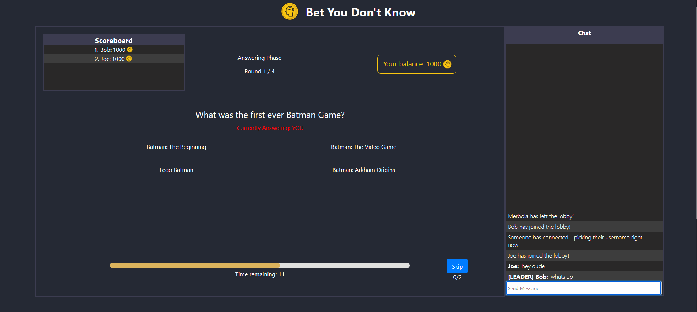

<p align="center">
  <a href="https://github.com/troygamedev/bet-you-dont-know">
    
  </a>

  <h3 align="center">Bet You Don't Know</h3>

  <p align="center">
    A realtime multiplayer game where players take turn answering trivia questions. 
    <br />
    <a href="https://bet-you-dont-know.herokuapp.com"><strong>Website »</strong></a>
  </p>
</p>


<!-- TABLE OF CONTENTS -->
<details open="open">
  <summary>Table of Contents</summary>
  <ol>
    <li>
      <a href="#about-the-project">About The Project</a>
      <ul>
        <li><a href="#built-with">Built With</a></li>
        <li><a href="#rules">Rules</a></li>
        <li><a href="#example">Example</a></li>
      </ul>
    </li>
    <li>
      <a href="#getting-started">Getting Started</a>
      <ul>
        <li><a href="#prerequisites">Prerequisites</a></li>
        <li><a href="#installation">Installation</a></li>
        <li><a href="#development">Development</a></li>
        <li><a href="#deployment">Deployment</a></li>
      </ul>
    </li>
    <li><a href="#license">License</a></li>
    <li><a href="#contact">Contact</a></li>
    <li><a href="#acknowledgements">Acknowledgements</a></li>
  </ol>
</details>


<!-- ABOUT THE PROJECT -->
## About The Project

</img>

Players can create lobbies (private or public) and invite their friends to play via URL. The game involves 2 main stages: answering and betting. During the answering phase, a single player answers a trivia question. During the betting phase, all the other players will place bets hoping that the answerer got the trivia question wrong: the higher the bet, the more money they can steal from the answerer. Look below for rules and example.

### Built With

Frontend:
* [Next.js](https://nextjs.org/)
* [React](https://reactjs.org/)
* [SCSS](https://sass-lang.com/)

Backend:
* [Express.js](https://expressjs.com/)
* [Node.js](https://nodejs.org/en/)
* [Socket.io](https://www.postgresql.org/)
* [Trivia Questions are fetched from this repo](https://github.com/troygamedev/trivia-game-data)

Host:
* [Heroku](https://www.heroku.com/)


### Rules
<details>
  <summary>Rules</summary>
  <div>
    <p>Players take turns answering trivia questions.</p>
    <p>On your turn:</p>
    <ol>
      <li>Answer the trivia question displayed. (multiple choice)</li>
      <li>All other players can place bets hoping that you answered incorrectly.</li>
      <li>If their prediction was right (you got the question wrong), you will have to pay however much they betted on you.</li>
      <li>However, if you proved them wrong and answered correctly, you will earn $1000 AND everyone who didn't believe in you will have to pay their bets to you!</li>
    </ol>
  </div>
</details>

### Example
<details>
  <summary>Example</summary>
  <div>
    <ol>
      <p>It's Bob's turn to answer:</p>
      <li>Bob answers the question: What is 1+1? Bob bluffs that he can't do math.</li>
      <li>John believes that Bob is indeed bad at math and bets $500 that Bob will answer incorrectly.</li>
      <li>No way! Bob guessed correctly and won $1000. Additionally, because John made an incorrect prediction, $500 is deducted from his balance and given to Bob!</li>
    </ol>
  </div>
</details>

<!-- GETTING STARTED -->
## Getting Started

Here is a guide if you want to clone my website and modify it for yourself, all the way to deployment.

### Prerequisites

* [yarn](https://yarnpkg.com/)
* [git](https://git-scm.com/)

### Installation

1. Clone the repo
   ```sh
   git clone https://github.com/troygamedev/bet-you-dont-know.git
   ```
2. Install packages
   ```sh
   yarn
   cd client
   yarn
   cd ../server
   yarn
   ```
3. Create a `.env` file in the /server folder and fill in the following info for the backend to function properly
   ```
   SESSION_SECRET=
   ADMIN_PASSWORD=
   ```


### Development

To run the development server
   ```sh
   yarn dev
   ```
Then head over to localhost:3000

### Deployment
1. Publish the site on Heroku using continuous git integration.
2. Enter in the environment variables (from `.env`) to Heroku via Heroku's CLI or through the website dashboard.

<!-- LICENSE -->
## License

Distributed under the MIT License. See `LICENSE` for more information.


<!-- CONTACT -->
## Contact

Ajay Liu - contact@ajayliu.com

Project Link: [https://github.com/troygamedev/bet-you-dont-know](https://github.com/troygamedev/bet-you-dont-know)


<!-- ACKNOWLEDGEMENTS -->
## Acknowledgements
* [bad-words for chat profanity filter](https://www.npmjs.com/package/bad-words)
* [day.js](https://day.js.org/)
* [sweetalert](sweetalert.js.org/)
* [react-switch](https://www.npmjs.com/package/react-switch)
* [react-collapsible](https://www.npmjs.com/package/react-collapsible)
